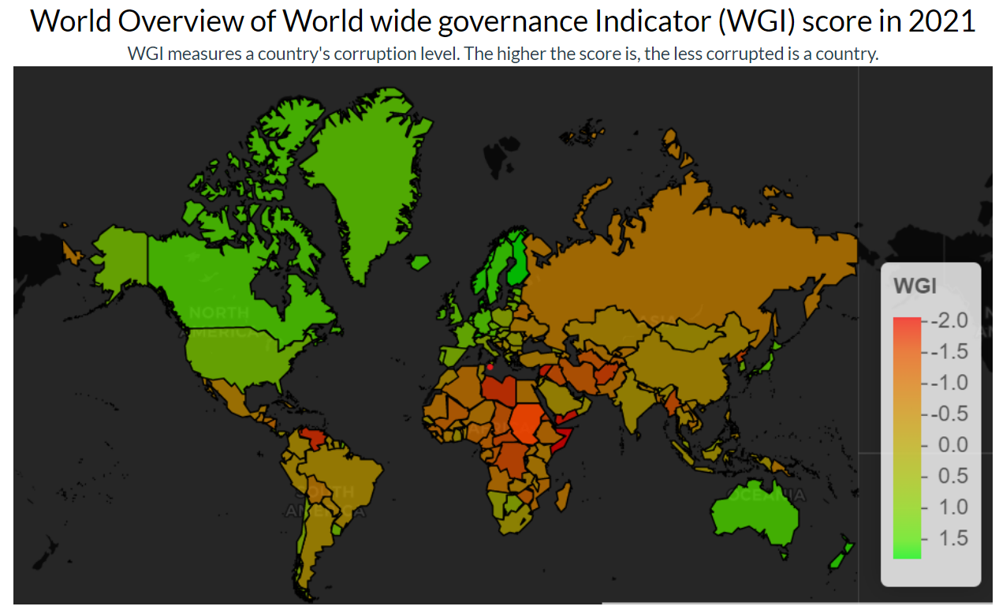

<style>                     
.navbar {
  background-color:#46ACC8;
  border-color:#46ACC8;
}
.navbar-brand {
color:black!important;
}


</style>   


```{r setup, include=FALSE}
library(flexdashboard)
library(tidyverse)
library(ggplot2)
library(plotly)
```

Column {data-width=650}
-----------------------------------------------------------------------

### Some static graph

```{r vis1,  echo = FALSE,  message = FALSE, warning=FALSE}


```

Column {.tabset .tabset-fade}
-----------------------------------------------------------------------


### Some dynamic maps

```{r  ggplotly, echo = TRUE,  eval = TRUE,  message = FALSE, warning=FALSE}
plotly::ggplotly(p1)
```


### Chart C

```{r}

```

