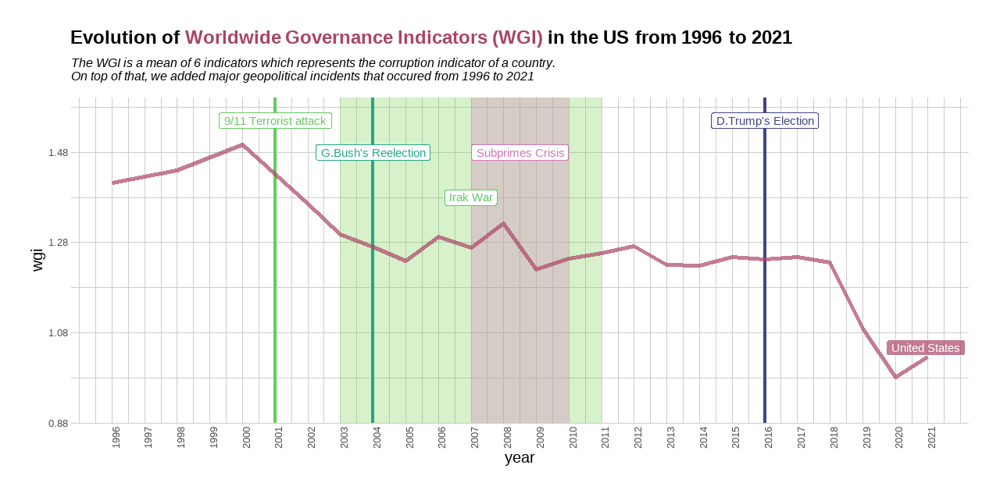

<style>                     
.navbar {
  background-color:#46ACC8;
  border-color:#46ACC8;
}
.navbar-brand {
color:black!important;
}


</style>   


```{r setup, include=FALSE}
library(flexdashboard)
library(tidyverse)
library(ggplot2)
library(plotly)
```

# World Corruption Overview 

```{r pressure, echo=FALSE, out.width = '100%'}
knitr::include_graphics("www/word_indicators.png")

```


# Corruption Evolution in the US

```{r, echo=FALSE,out.width = '100%'}


```

# Indicators Repartition in the US

```{r, echo=FALSE, out.width = '100%'}


```

